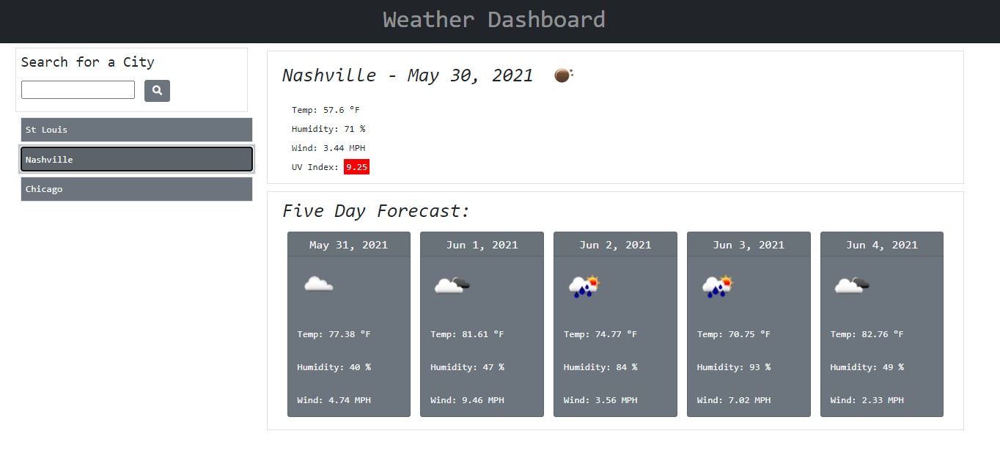

# The Weather Dashboard

## Objective

Build a weather dashboard that will run in the browser and feature dynamically updated HTML and CSS. Use OpenWeather One Call API to retrieve weather data for cities and use localStorage to store searched cities.

## Review

- Deployed application: [https://rogerscl116.github.io/the-weather-dashboard](https://rogerscl116.github.io/the-weather-dashboard)  
- GitHub repository: [https://github.com/rogerscl116/the-weather-dashboard](https://github.com/rogerscl116/the-weather-dashboard)

## Built With

- HTML
- CSS
- FONT AWESOME
- JAVASCRIPT
- MOMENT.JS

## Screenshot

*Created by Charity Rogers*

